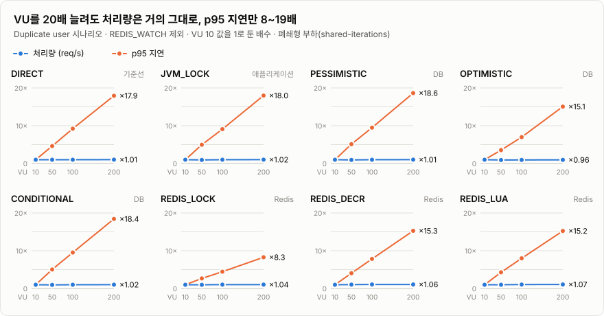
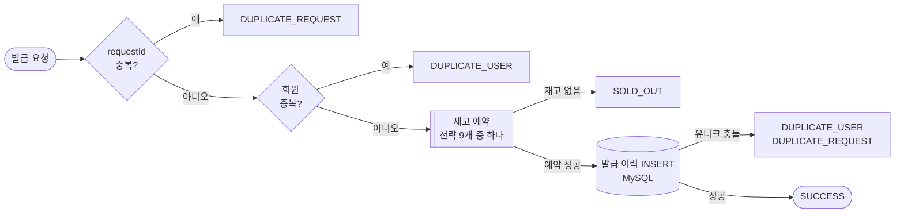

# coupon-concurrency-strategies

선착순 쿠폰 발급이라는 같은 문제에 동시성 제어 전략 9개를 적용하고,
**각 전략이 정합성·가용성·처리량·지연 중 무엇을 내주는지** 측정한 실험입니다.

"어떤 구현이 가장 빠른가"보다, 실제 발급 기능에 쓸 전략을 고를 근거를 만드는 것이 목적입니다.

> [!NOTE]
> **상태:** 로컬 단일 호스트 1차 결과 (2026-08-14 ~ 08-16). 조건별 1회 실행이라 절대 성능 순위로 쓰지 않습니다. → [해석 제한](docs/environment.md#해석-제한)

---

## 한눈에 보기

| 전략 | 계열 | 초과 발급 없음 | 재고 원장 일치 | 오류 응답 없음 | 1인 1매 | 대상자 전원 발급 | 응답 분류 정확 |
|---|---|:---:|:---:|:---:|:---:|:---:|:---:|
| `DIRECT` | 기준선 | ✗ | ✗ | ✓ | ✓ | ✓ | ✓ |
| `JVM_LOCK` | 애플리케이션 | ✓ | ✓ | ✓ | ✓ | ✓ | ✓ |
| `PESSIMISTIC` | DB | ✓ | ✓ | ✓ | ✓ | ✓ | ✗ |
| `OPTIMISTIC` | DB | ✓ | ✓ | ✗ | ✓ | ✗ | ✗ |
| `CONDITIONAL` | DB | ✓ | ✓ | ✓ | ✓ | ✓ | ✗ |
| `REDIS_LOCK` | Redis | ✓ | ✓ | ✗ | ✓ | △ | ✗ |
| `REDIS_DECR` | Redis | ✓ | ✓ | ✓ | ✓ | ✗ | ✗ |
| `REDIS_LUA` | Redis | ✓ | ✓ | ✓ | ✓ | ✗ | ✗ |
| `REDIS_WATCH` | Redis | ✓ | ✓ | ✗ | ✓ | ✗ | ✗ |

앞의 세 기준은 [Unique user](docs/01-unique-user.md) 3단계, 뒤의 세 기준은 [Duplicate user](docs/02-duplicate-user.md) VU 50 정순·역순 결과입니다. ✓ 통과 · ✗ 실패 · △ 실행마다 다름. 각 기준의 정의는 [용어](docs/glossary.md#판정-기준)에 있습니다.

> [!IMPORTANT]
> 모든 기준을 통과한 것은 `JVM_LOCK`뿐이지만, **단일 인스턴스에서만 유효합니다.** 다중 인스턴스 해법으로 평가할 수 없습니다.

## 핵심 결과

1. **`DIRECT`는 재고 원장이 깨졌습니다.** 락 없는 read-modify-write에서 lost update가 재현됐습니다. 재고 1,000개에 9,997건이 발급됐고, 1인 1매 시나리오에서는 발급 이력 10,000건 중 재고 차감은 약 2,500건만 반영됐습니다.
2. **초과 발급이 없어도 실패일 수 있습니다.** 한 회원이 3번씩 요청하는 시나리오에서 1인 1매는 모든 전략이 지켰습니다. 하지만 응답 분류, 대상자 전원 발급, 재고 원장까지 모두 통과한 전략은 단일 인스턴스의 `JVM_LOCK`뿐이었습니다. 락이 중복 검사부터 커밋까지 전부 감싸는 유일한 전략입니다.
3. **Redis 선예약 방식은 정상 회원을 탈락시켰습니다.** `REDIS_LUA`·`REDIS_DECR`에서는 같은 회원의 중복 요청이 Redis 재고를 먼저 잡습니다. DB 유니크 충돌로 보상하는 사이에 다른 회원이 품절 응답을 받았고, 최종 원장은 맞지만 1~2명이 쿠폰을 받지 못했습니다. → [시퀀스 다이어그램](docs/02-duplicate-user.md#왜-이런-결과가-나왔나)
4. **`REDIS_WATCH`는 연결 관리 때문에 무너졌습니다.** WATCH 충돌 재시도마다 Redis 연결이 새로 생성·종료되면서 TIME_WAIT가 약 14,900개 쌓였고, 로컬 동적 포트(16,384개)가 고갈됐습니다. 요청 30,000건 중 약 90%가 무응답이었고, VU 10·50·100·200에서 모두 재현됐습니다.
5. **VU를 늘려도 처리량은 거의 그대로였습니다.** 폐쇄형 부하(`shared-iterations`)라서 `req/s × 평균 지연 ≈ VU 수`가 성립합니다. `REDIS_WATCH`를 제외한 8개 전략은 VU 50→200에서 req/s가 1.0~8.3%만 늘었고, p95만 VU에 비례해 커졌습니다. → [VU 확장](docs/03-vu-scaling.md)

<picture>
  <source media="(prefers-color-scheme: dark)" srcset="docs/images/vu-scaling-dark.svg">
  
</picture>

## 알게 된 실패 경계

| 현상 | 원인 | 확실성 |
|---|---|---|
| 재고 원장 불일치 (`DIRECT`) | 읽은 값을 기준으로 절대값을 다시 쓰는 lost update | 확정 |
| 정상 회원 미발급 (`REDIS_LUA`·`REDIS_DECR`) | 중복 검사보다 재고 예약이 먼저 반영되고, 보상 전까지 재고가 비어 보임 | 관측 |
| 중복 요청의 `SOLD_OUT` 오분류 (`PESSIMISTIC`·`CONDITIONAL`) | 회원 중복 사전 조회가 최초 발급 커밋 전에 통과한 뒤 재고 0을 만남 (check-then-act) | 관측 |
| 연결 고갈 (`REDIS_WATCH`) | 재시도마다 Redis 연결 생성·종료, TIME_WAIT 약 14,900개, `Address already in use` | 확정 |
| 낮은 VU에서의 retry storm (`OPTIMISTIC`) | 즉시 재시도 20회 × Hikari pool 10 | 강한 추론 |
| 포화 | Hikari pool 10, 단일 재고 행 잠금, Tomcat worker 200 | 추론 |

확실성 등급의 기준은 [용어](docs/glossary.md#확실성-등급)에 있습니다.

---

## 실험 설계

독립 변수는 **재고 예약 전략 하나**입니다. 나머지 발급 흐름은 모든 전략이 같습니다.



| 계열 | 전략 | 재고 예약 방식 |
|---|---|---|
| 기준선 | `DIRECT` | SELECT → 재고 확인 → 엔티티 변경 → UPDATE (제어 없음) |
| 애플리케이션 | `JVM_LOCK` | `ReentrantLock`으로 같은 쿠폰의 발급 흐름 전체를 직렬화 |
| DB | `PESSIMISTIC` | `SELECT ... FOR UPDATE` 후 차감 |
| | `OPTIMISTIC` | version CAS UPDATE, 충돌 시 재시도 |
| | `CONDITIONAL` | `UPDATE ... WHERE remaining_quantity > 0`, affected rows로 성공/품절 판정 |
| Redis | `REDIS_LOCK` | `SET NX + TTL` 락 획득 후 GET → DECR |
| | `REDIS_DECR` | `DECR` 후 음수면 `INCR`로 보상 |
| | `REDIS_LUA` | GET·조건 검사·DECR을 Lua script 하나로 실행 |
| | `REDIS_WATCH` | `WATCH / MULTI / EXEC`, 충돌 시 재시도 |

Redis 전략도 중복 검사와 발급 이력 저장에는 MySQL을 쓰고, INSERT가 실패하면 Redis 재고를 `INCR`로 되돌립니다. 결과는 Redis 명령 자체가 아니라 HTTP 발급 경로 전체의 end-to-end 수치입니다. 재시도 횟수 같은 전략별 설정은 [실행 환경](docs/environment.md#전략별-설정)에 있습니다.

| 시나리오 | 재고 | 요청 | 확인하는 것 | 보고서 |
|---|---:|---:|---|---|
| Unique user · Basic / Contention / Performance | 100 / 100 / 1,000 | 200 / 1,000 / 10,000 | 초과 발급, 재고 원장, 처리량·지연 | [01](docs/01-unique-user.md) |
| Duplicate user (정순·역순) | 10,000 | 30,000 (10,000명 × 3회) | 1인 1매, 대상자 전원 발급, 응답 분류, 재고 원장 | [02](docs/02-duplicate-user.md) |
| Duplicate user · VU 확장 | 10,000 | 30,000 × VU 10 / 50 / 100 / 200 | 포화 지점, 병목 | [03](docs/03-vu-scaling.md) |

## 문서

| 문서 | 내용 |
|---|---|
| [01 Unique user](docs/01-unique-user.md) | 초과 발급, 오류 응답, Performance 단계 처리량·지연 |
| [02 Duplicate user](docs/02-duplicate-user.md) | 정순·역순 판정, 실패 메커니즘 시퀀스 다이어그램, `REDIS_WATCH` 연결 고갈 |
| [03 VU 확장](docs/03-vu-scaling.md) | VU별 판정, 포화 차트, 병목, `OPTIMISTIC` VU 10 역전 |
| [실행 환경](docs/environment.md) | 하드웨어·소프트웨어 사양, 전략별 설정, 격리 방법, 공통 해석 제한 |
| [재현 방법](docs/reproduce.md) | 환경변수, 스키마, 시드, 실행 스크립트, 테스트 |
| [실험 API](docs/api.md) | 엔드포인트, 결과 코드, Redis key |
| [용어](docs/glossary.md) | 용어 통일표, 판정 기준, 확실성 등급 |
| [결과 데이터](k6/results/README.md) | Run index, 보고서별 기준 데이터 |

## 다음 단계

1. `REDIS_WATCH`: 같은 연결에서 WATCH/MULTI/EXEC를 수행하고 연결을 재사용하도록 고친 뒤 재측정
2. Redis 전략: 회원 중복 검사와 재고 예약을 Lua script 안에서 원자적으로 처리하는 변형을 추가해, 정상 회원 미발급이 사라지는지 확인
3. `OPTIMISTIC`: 요청별 retry 횟수 계측, VU 8/10/12/20 반복, backoff 적용 전후 비교
4. 전략별 3회 이상 반복 + 실행 순서 회전
5. k6·앱·DB·Redis를 분리한 환경에서 재검증, Tomcat worker·Hikari pool·MySQL 연결 한도를 명시적으로 고정

## 빠른 시작

```powershell
# MySQL 8.4(3307), Redis 7(6380)을 띄우고 스키마·회원 데이터를 넣은 뒤
$env:DB_URL = 'jdbc:mysql://localhost:3307/coupon_poc'
$env:DB_PASSWORD = '<password>'
$env:REDIS_PORT = '6380'
.\gradlew.bat bootRun

# 다른 터미널에서
./k6/run-experiments.ps1 -Stage duplicate-user -Vus 50
```

스키마 생성과 시나리오별 명령은 [재현 방법](docs/reproduce.md)에 있습니다.
