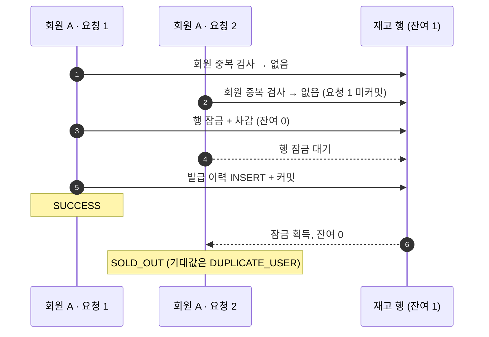
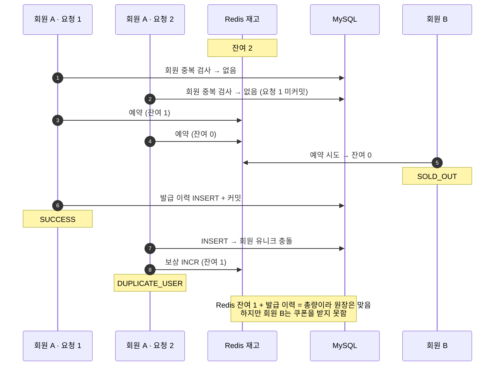

# Duplicate user 시나리오 (정순·역순)

> 실행 2026-08-16 · VU 50 · 데이터 정순 [`r0816dup1`](../k6/results/r0816dup1/) (+ [`r0816dup2w`](../k6/results/r0816dup2w/)), 역순 [`r0816duprev1`](../k6/results/r0816duprev1/) (+ [`r0816duprev1w`](../k6/results/r0816duprev1w/))

같은 회원이 서로 다른 `requestId`로 3번 요청할 때 1인 1매, 대상자 전원 발급, 응답 분류, 재고 원장을 함께 확인합니다. **초과 발급이 없어도 실패일 수 있다**는 것을 보여주는 시나리오입니다.

## 조건

| 항목 | 값 |
|---|---|
| 재고 | 10,000 |
| 대상 회원 | 10,000명 |
| 회원당 요청 | 3건 (연속된 iteration이라 거의 동시에 들어감) |
| 전략별 요청 | 30,000건 |
| 기대 응답 | `SUCCESS=10,000`, `DUPLICATE_USER=20,000`, 나머지 0 |
| 정순 | `DIRECT → JVM_LOCK → PESSIMISTIC → OPTIMISTIC → CONDITIONAL → REDIS_LOCK → REDIS_DECR → REDIS_LUA → REDIS_WATCH` |
| 역순 | `REDIS_WATCH`를 먼저 단독 실행하고 로컬 포트와 Redis API가 회복된 것을 확인한 뒤 `REDIS_LUA → … → DIRECT` |

정순의 `REDIS_WATCH` 행은 앞 전략들의 영향을 배제하려고, Redis TIME_WAIT가 0인 상태에서 단독 재실행한 [`r0816dup2w`](../k6/results/r0816dup2w/) 값으로 바꿨습니다. 공통 환경은 [실행 환경](environment.md)에 있습니다.

## 판정

값이 두 개인 칸은 `정순 / 역순`입니다.

| 전략 | 1인 1매 | 대상자 전원 발급 | 응답 분류 | 재고 원장 | 통과 |
|---|:---:|---|---|---|:---:|
| `DIRECT` | ✓ | ✓ | ✓ | ✗ 차감 2,508 / 2,502 (발급 10,000) | ✗ |
| `JVM_LOCK` | ✓ | ✓ | ✓ | ✓ | **✓** |
| `PESSIMISTIC` | ✓ | ✓ | ✗ 중복 2건이 `SOLD_OUT` | ✓ | ✗ |
| `OPTIMISTIC` | ✓ | ✗ 9,999 / 9,997명 | ✗ 오류 응답 14 / 11 | ✓ | ✗ |
| `CONDITIONAL` | ✓ | ✓ | ✗ 중복 2건이 `SOLD_OUT` | ✓ | ✗ |
| `REDIS_LOCK` | ✓ | △ 10,000 / 9,999명 | ✗ 오류 응답 312 / 287 | ✓ | ✗ |
| `REDIS_DECR` | ✓ | ✗ 9,999 / 9,999명 | ✗ `SOLD_OUT` 13 / 13 | ✓ | ✗ |
| `REDIS_LUA` | ✓ | ✗ 9,998 / 9,998명 | ✗ `SOLD_OUT` 13 / 13 | ✓ | ✗ |
| `REDIS_WATCH` | ✓ | ✗ 945 / 946명 | ✗ 무응답 27,000 / 26,991 | ✓ | ✗ |

- **두 실행 모두 통과한 전략은 단일 인스턴스의 `JVM_LOCK`뿐입니다.** 실행 순서를 뒤집어도 전략별 실패 유형과 결론은 같았습니다.
- **1인 1매는 모든 전략이 지켰습니다.** DB 교차 확인에서 회원별 최대 발급 수는 두 실행 모두 1이었고, 역순 실행에서는 `COUNT(*) = COUNT(DISTINCT user_id) = COUNT(DISTINCT request_id)`까지 확인했습니다.
- `REDIS_LOCK`의 대상자 전원 발급은 실행마다 결과가 달랐습니다 (△).

## 응답 분포

| 전략 | 성공 | 중복 회원 | 품절 | 오류 응답 | 무응답 |
|---|---:|---:|---:|---:|---:|
| `DIRECT` | 10,000 / 10,000 | 20,000 / 20,000 | 0 / 0 | 0 / 0 | 0 / 0 |
| `JVM_LOCK` | 10,000 / 10,000 | 20,000 / 20,000 | 0 / 0 | 0 / 0 | 0 / 0 |
| `PESSIMISTIC` | 10,000 / 10,000 | 19,998 / 19,998 | 2 / 2 | 0 / 0 | 0 / 0 |
| `OPTIMISTIC` | 9,999 / 9,997 | 19,987 / 19,992 | 0 / 0 | 14 / 11 | 0 / 0 |
| `CONDITIONAL` | 10,000 / 10,000 | 19,998 / 19,998 | 2 / 2 | 0 / 0 | 0 / 0 |
| `REDIS_LOCK` | 10,000 / 9,999 | 19,679 / 19,708 | 9 / 6 | 312 / 287 | 0 / 0 |
| `REDIS_DECR` | 9,999 / 9,999 | 19,988 / 19,988 | 13 / 13 | 0 / 0 | 0 / 0 |
| `REDIS_LUA` | 9,998 / 9,998 | 19,989 / 19,989 | 13 / 13 | 0 / 0 | 0 / 0 |
| `REDIS_WATCH` | 945 / 946 | 1,778 / 1,796 | 0 / 0 | 277 / 267 | 27,000 / 26,991 |

최종 잔여 재고가 0이 아닌 전략입니다. `DIRECT`를 제외하면 잔여 재고(Redis 전략은 Redis 잔여)와 발급 이력 수의 합이 모두 10,000이었습니다.

| 전략 | 정순 | 역순 |
|---|---:|---:|
| `DIRECT` (DB) | 7,492 | 7,498 |
| `OPTIMISTIC` (DB) | 1 | 3 |
| `REDIS_LOCK` | 0 | 1 |
| `REDIS_DECR` | 1 | 1 |
| `REDIS_LUA` | 2 | 2 |
| `REDIS_WATCH` | 9,055 | 9,054 |

## 왜 이런 결과가 나왔나

### 락이 감싸는 범위

| 전략 | 회원 중복 검사 | 재고 예약 | 발급 이력 커밋 |
|---|---|---|---|
| `JVM_LOCK` | 락 안 | 락 안 | 락 안 |
| `PESSIMISTIC` · `CONDITIONAL` | 잠금 밖 | 재고 행 잠금 | 같은 트랜잭션 |
| Redis 계열 | 잠금 밖 | Redis에 즉시 반영 | MySQL, 실패하면 Redis에 보상 |

`JVM_LOCK`은 발급 흐름 전체를 쿠폰별 락 안에서 실행하므로, 다음 요청은 앞 요청의 커밋 결과를 보고 중복 검사를 합니다. 다른 전략은 중복 검사가 잠금 밖에 있어서, 같은 회원의 요청 3건이 모두 중복 검사를 통과할 수 있습니다. 그 뒤에 무엇이 일어나는지가 전략마다 다릅니다.

### `PESSIMISTIC`·`CONDITIONAL`: 중복 요청이 품절로 분류됨 (관측)

재고가 남아 있을 때는 요청 2가 차감한 뒤 INSERT에서 유니크 제약에 걸리고, 트랜잭션이 롤백되면서 `DUPLICATE_USER`로 정확히 분류됩니다. 재고가 0이 되는 마지막 순간에만 품절로 잘못 분류되므로 두 실행 모두 2건에 그쳤습니다. 재고 원장과 대상자 전원 발급에는 영향이 없습니다.

### `REDIS_DECR`·`REDIS_LUA`: 정상 회원이 품절을 받음 (관측)

Redis 차감은 다른 요청에 즉시 보이고, 보상(`INCR`)은 DB 실패 뒤에 따로 실행됩니다. 그 사이에 들어온 다른 회원은 재고 0을 보고 품절을 받습니다. DB 전략에서는 차감과 INSERT가 한 트랜잭션이라, 다른 요청이 행 잠금 뒤에서 기다렸다가 롤백된 값을 보므로 이 문제가 생기지 않습니다.

결과적으로 Redis에 1~2개가 남고 그만큼의 회원이 미발급됐습니다. `REDIS_LOCK`도 같은 구조라 품절이 9 / 6건 나왔고, 여기에 락 획득 한도 소진으로 보이는 오류 응답이 더해졌습니다.

### `OPTIMISTIC`: 재시도 소진

오류 응답 14 / 11건 가운데, 한 회원의 요청 3건이 모두 성공하지 못한 경우가 1 / 3명 있었고 그만큼 미발급됐습니다. 재시도는 최대 20회 즉시 반복이고 backoff가 없습니다.

### `REDIS_WATCH`: 연결 고갈 (확정)

| 항목 | 정순 단독 재실행 | 역순 첫 실행 |
|---|---:|---:|
| 서버 응답을 받은 요청 | 3,000 | 3,009 |
| 무응답 | 27,000 | 26,991 |
| 성공 | 945 | 946 |
| 중복 회원 | 1,778 | 1,796 |
| 오류 응답 | 277 | 267 |
| Redis 잔여 | 9,055 | 9,054 |

- WATCH 충돌 재시도마다 Redis 연결이 새로 생성·종료되면서, 실행 직후 Redis 포트의 TIME_WAIT가 약 14,900개였습니다. 로컬 동적 포트는 16,384개입니다.
- 애플리케이션 로그에 Lettuce `Unable to connect to Redis`와 `BindException: Address already in use`가 남았습니다.
- 이 상태에서는 k6와 PowerShell도 8080 연결에 쓸 로컬 포트를 얻지 못했습니다.
- 재고 원장은 맞았습니다. 원장은 맞지만 요청을 처리하지 못하는 구현입니다.

## 지연

단위는 ms입니다. `REDIS_WATCH`의 전체 지연과 req/s는 비교에서 뺐습니다. 약 27,000건의 전송 실패가 매우 짧은 시간으로 들어가 전체 통계를 왜곡하기 때문입니다. `REDIS_WATCH`의 성공·중복 지연은 서버 응답을 받은 요청만의 값입니다.

정순 P90 / P95 / P99

| 전략 | 전체 P90 | 전체 P95 | 전체 P99 | 성공 P90 | 성공 P95 | 성공 P99 | 중복 P90 | 중복 P95 | 중복 P99 |
|---|---:|---:|---:|---:|---:|---:|---:|---:|---:|
| `DIRECT` | 144.19 | 148.88 | 168.63 | 142.34 | 146.82 | 166.63 | 144.93 | 149.57 | 169.82 |
| `JVM_LOCK` | 319.41 | 324.63 | 340.69 | 321.27 | 326.07 | 342.55 | 318.46 | 323.52 | 338.67 |
| `PESSIMISTIC` | 211.97 | 216.59 | 235.58 | 211.08 | 215.65 | 233.41 | 212.36 | 217.04 | 236.60 |
| `OPTIMISTIC` | 446.88 | 554.65 | 798.18 | 431.74 | 523.83 | 761.22 | 467.05 | 560.65 | 798.63 |
| `CONDITIONAL` | 209.17 | 215.46 | 238.75 | 207.87 | 213.71 | 233.92 | 209.79 | 216.07 | 242.12 |
| `REDIS_LOCK` | 197.45 | 220.01 | 257.59 | 162.46 | 168.49 | 185.72 | 206.23 | 224.50 | 255.40 |
| `REDIS_DECR` | 97.17 | 100.14 | 129.56 | 92.98 | 95.59 | 102.40 | 98.30 | 101.46 | 140.62 |
| `REDIS_LUA` | 95.54 | 98.17 | 111.33 | 91.29 | 93.74 | 101.15 | 96.55 | 99.41 | 133.54 |
| `REDIS_WATCH` | — | — | — | 256.60 | 284.66 | 329.74 | 313.72 | 336.97 | 395.63 |

역순 P90 / P95 / P99

| 전략 | 전체 P90 | 전체 P95 | 전체 P99 | 성공 P90 | 성공 P95 | 성공 P99 | 중복 P90 | 중복 P95 | 중복 P99 |
|---|---:|---:|---:|---:|---:|---:|---:|---:|---:|
| `DIRECT` | 131.78 | 134.74 | 150.48 | 130.14 | 133.03 | 149.40 | 132.39 | 135.37 | 151.23 |
| `JVM_LOCK` | 332.26 | 337.45 | 360.65 | 334.33 | 338.69 | 361.80 | 331.15 | 336.61 | 359.38 |
| `PESSIMISTIC` | 219.66 | 225.87 | 243.90 | 218.72 | 224.79 | 240.61 | 220.12 | 226.20 | 246.04 |
| `OPTIMISTIC` | 453.56 | 561.39 | 815.34 | 437.88 | 524.72 | 776.77 | 472.00 | 567.72 | 818.75 |
| `CONDITIONAL` | 200.37 | 204.51 | 217.53 | 199.15 | 203.20 | 213.49 | 200.88 | 205.12 | 219.47 |
| `REDIS_LOCK` | 190.00 | 211.05 | 250.82 | 155.05 | 161.12 | 180.61 | 198.33 | 216.10 | 246.72 |
| `REDIS_DECR` | 95.72 | 98.16 | 109.16 | 91.47 | 93.59 | 99.98 | 96.80 | 99.32 | 134.50 |
| `REDIS_LUA` | 100.84 | 104.46 | 123.11 | 96.42 | 99.63 | 111.21 | 102.17 | 105.86 | 137.79 |
| `REDIS_WATCH` | — | — | — | 296.82 | 317.07 | 359.17 | 365.52 | 386.49 | 448.38 |

## 이 시나리오의 해석 제한

- 지연 수치는 단일 실행 노이즈와 실행 시점의 시스템 상태에 영향을 받습니다. 정순과 역순 사이에도 값이 달라지므로 절대 순위로 해석하지 않습니다.
- 공통 제한은 [실행 환경 › 해석 제한](environment.md#해석-제한)에 있습니다.

## 원본 데이터

- 정순 통합본: [CSV](../k6/results/r0816dup1/duplicate-user-results.csv) · [JSON](../k6/results/r0816dup1/duplicate-user-results.json) (`REDIS_WATCH` 행은 [`r0816dup2w`](../k6/results/r0816dup2w/experiment-results.csv))
- 역순 통합본: [CSV](../k6/results/r0816duprev1/duplicate-user-reverse-results.csv) · [JSON](../k6/results/r0816duprev1/duplicate-user-reverse-results.json) (`REDIS_WATCH` 행은 [`r0816duprev1w`](../k6/results/r0816duprev1w/experiment-results.csv))
- 폴더별 파일 설명은 [결과 데이터 안내](../k6/results/README.md)에 있습니다.
